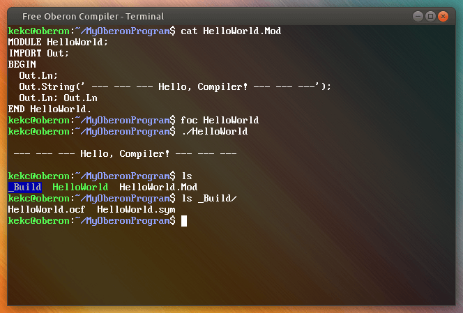

# Cross-platform Oberon Compiler



## Console Compiler for Component Pascal for Windows and Linux

* [YouTube-channel about the project](https://www.youtube.com/channel/UCfaaot6JjktvqQCUOkXxEsA)
* [Free Oberon website](https://free.oberon.org/en)

*See Engish version below*

# Кроссплатформенный компилятор Оберона
## Консольный компилятор Компонентного Паскаля для Виндоуса и Линукса

* [Ютуб-канал о данном проекте](https://www.youtube.com/channel/UCfaaot6JjktvqQCUOkXxEsA)
* [Сайт Free Oberon](https://free.oberon.org)

## Быстрый старт

1. В командной строке Линукса или Виндоуса перейдите в каталог `foc` и наберите команду:
```
make
```
Для Линукса см. примечания ниже.

2. Для компиляции и запуска тестовой программы наберите:

На Линуксе:
```
cd tests/tinytest
../../foc Prog1
./Prog1
```

На Виндоусе:
```
cd tests\tinytest
..\..\foc Prog1
Prog1
```

Запускать компилятор foc можно из любого каталога — он сам определяет своё
местоположение. Файлы обязательно должны иметь расширение `.Mod`, а имена
файлов должны совпадать с именами модулей.

В имени файла можно указывать платформу (ОС), например: `Term-Linux.Mod`,
`Term-Win.Mod`. Компилятор будет брать тот или иной файл в зависимости от
того, на какой платформе он запущен.

Если имя модуля состоит из двух и более слов (например, `GuiButtons`), его
позволяется поместить в каталог `Gui`, а сам файл назвать `Buttons.Mod`.

Файлы, получающиеся в результате компиляции модулей, помещаются в каталог
`_Build`.

Рядом с исполняемым файлом компилятора есть каталог `Lib`. Откомпилированные
модули, находящиеся в `Lib/_Build`, при необходимости автоматически
подключаются к вашей программе.

### Примечания для Линукса

Чтобы собрать проект, у вас должна быть установлена программа `make`,
считывающая файл `Makefile` и запускающая команды, указанные в нём.
Эти команды при желании можно запустить вручную.

Для установки Make на Дебиане, Убунту и т. п. наберите:
```
sudo apt-get install make
```

### Примечания для Виндоуса

На Виндоусе вместо Make используется файл-сценарий `make.bat`.
Перед сборкой компилятора сценарий переименовывает файлы
и каталоги с префиксом `__WIN_`, убирая этот префикс. Например:

* `Host\Mod\__Win_Args.Mod` → `Host\Mod\Args.Mod`
* `__WIN_BlackBox` → `BlackBox`

При этом Линукс-версии файлов получают префикс `__LIN_`:
* `BlackBox` → `__LIN_BlackBox`
* `Host\Mod\Args.Mod` → `Host\Mod\__LIN_Args.Mod`

## Инструкция по использованию

Компилятор можно запускать из любого каталога. Главный модуль
компилируемой программы должен находиться в текущем каталоге.

Запуск на Линуксе:
```
./foc <название_главного_модуля>
```

На Виндоусе:
```
foc <название_главного_модуля>
```

Компилятор сам добавляет расширение `.Mod` (но его всё же разрешается указать)
к названию модуля, открывает соответствующиий файл, после чего рекурсивно
обходит все файлы проекта, включая уже откомпилированные sym- или ocf-файлы,
находящиеся в «системном» каталоге `Lib/_Build`.

## Как пересобрать ББКП для обновления подкаталога BlackBox

Компилятор использует сборку Блекбокса проекта BBCP версии 1.8.
Чтобы скачать исходные коды ББКП необходим Git. Установите Git командой
`sudo apt-get install git` на Дебиане/Убунту. На Виндоусе скачайте
и установите [Git for Windows](https://git-scm.com/download/win) или
[GitHub CLI](https://cli.github.com/).

1. Скачайте ББКП из Git-репозитория с помощью команды `git clone`:
```
git clone https://github.com/bbcb/bbcp.git
```
или через GitHub CLI:
```
gh repo clone bbcb/bbcp
```

2. Внутри ББКП зайдите в подкаталог `BlackBox` и с помощью следующей
команды перейдите в ветку `dev18`:
```
git checkout dev18
```

3. Установите режим `Linux Interp` (или `Windows Interp`, если вы
пересобираете ББКП для Виндоуса, но это можно сделать и вручную,
см. ниже):
```
./switch-target Linux Interp
./build
./export ../Interp
```
Затем переименуйте каталог `Interp` в `BlackBox` и расположите
его рядом с исполняемым файлом `foc` (или `foc.exe`).

На Виндоусе можно вместо выполнения команды `switch-target`
вручную скопировать содержимое подкаталогов `_Windows`,
`_Windows_Interp` и `__Interp` в каталог `BlackBox` и запустить
сценарий `build.bat`. Это описанов в файле `README` проекта ББКП.

Примечание. В ходе сборки FOC вместо некоторых файлов ББКП
используются изменённые версии файлов. Они называются так же
(с точностью до расширения) и располагаются в таких же
подкаталогах, но рядом с каталогом `BlackBox`, а не в нём.
Например, вместо файла `BlackBox/Host/Mod/Files.odc` при сборке
используется файл `Host/Mod/Files.Mod` (не в каталоге
`BlackBox`). Эти пары файлов могут легко разойтись при выходе
новых версий ББКП, поэтому их придётся заменить новыми версиями
и соответствующиим образом отредактировать.

______


*ENGLISH VERSION*

# Free Oberon Compiler

## Quick Start

1. On Linux or Windows command line go to the `foc` directory and type:
```
make
```
For Linux, see the notes below.

2. To compile and run the test program, type:

On Linux:
```
cd tests/tinytest
../../foc Prog1
./Prog1
```

On Windows:
```
cd tests\tinytest
..\..\foc Prog1
Prog1
```

You can run the foc compiler from any directory–it determines its location by
itself. The files must have the extension `.Mod`, and the file names must match
the names of the modules.

It is possible to specify the platform (OS) in the file name, for example:
`Term-Linux.Mod`,` Term-Win.Mod`. The compiler will take the corresponding file
depending on what platform it is running on.

If a module name consists of two or more words (for example, `GuiButtons`), it
is possible to place it in the `Gui` directory, and rename the file as
`Buttons.Mod`.

The files resulting from the compilation of modules are placed in the `_Build`
directory.

There is a `Lib` directory next to the compiler executable file. The compiled
modules in `Lib/_Build` are automatically linked to your program when it is
required.

### Notes for Linux

To build the project, `make` program should be installed in your
system. It reads `Makefile` and runs commands specified in it.

To install `make` on Debian, Ubuntu, etc. type:
```
sudo apt-get install make
```

You can also do without `make` by manually executing commands
in the `Makefile` in the correct order (please read how Make works).

### Notes for Windows

On Windows, `make.bat` script is used instead of Make.
Before building the compiler, the script renames those files and
directories that are prefixed with `__WIN_`, by removing
this prefix. For example:
* `Host\Mod\__Win_Args.Mod` → `Host\Mod\Args.Mod`
* `__WIN_BlackBox` → `BlackBox`

Linux versions of the files are being automatically prefixed with `__LIN_`:
* `BlackBox` → `__LIN_BlackBox`
* `Host\Mod\Args.Mod` → `Host\Mod\__LIN_Args.Mod`

## Usage

You can run the compiler from any directory. The main module
of the compiled program must be in the current directory.

Running on Linux:
```
./foc <main_module_name>
```
On Windows:
```
foc <main_module_name>
```

The compiler adds the `.Mod` extension to the supplied module name,
opens the corresponding file, and then recursively traverses all files
of the project, including already compiled files located in the
so-called system directory, that is in the `BlackBox` directory next
to the `foc` (or `foc.exe`).

## How to rebuild the BBCP to update the BlackBox subdirectory

The compiler uses BBCP version 1.8, which is a Blackbox build.
To download the BBCP source code, Git is required. Install Git with the
command `sudo apt-get install git` on Debian/Ubuntu. On Windows, download
and install [Git for Windows](https://git-scm.com/download/win)
or [GitHub CLI](https://cli.github.com/).

1. Download BBCP from the Git repository using `git clone` command:
```
git clone https://github.com/bbcb/bbcp.git
```
or using GitHub CLI:
```
gh repo clone bbcb/bbcp
```

2. Inside BBCP, go to the `BlackBox` subdirectory and type the following
command to switch to the` dev18` branch:
```
git checkout dev18
```

3. Switch mode to `Linux Interp` (or `Windows Interp` if you are
rebuilding BBCP for Windows; this can also be done manually, see below):
```
./switch-target Linux Interp
./build
./export ../Interp
```
Then rename the `Interp` directory to `BlackBox` and place it next to
the executable file `foc` (or` foc.exe`).

On Windows, instead of executing the `switch-target` command, you can
manually copy the contents of the subdirectories `_Windows`,
`_Windows_Interp` and `__Interp` into the `BlackBox` directory and run
`build.bat`. This is described in the `README` file of the BBCP project.

Note. During FOC build process, the modified versions of the files
are used instead of some of the BBCP own files. They are named in the
same way (up to extension) and are located in the same subdirectories,
but next to the `BlackBox` directory and not inside it. For example,
instead of `BlackBox/Host/Mod/Files.odc`, the build uses the file
`Host/Mod/Files.Mod` (not in the `BlackBox` directory). These pairs of
files can easily diverge when new versions of the BBCP are released, so
they will have to be replaced with new versions and edited accordingly.
